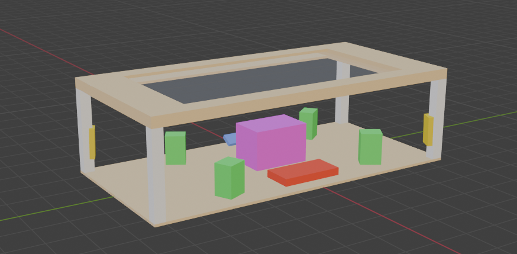
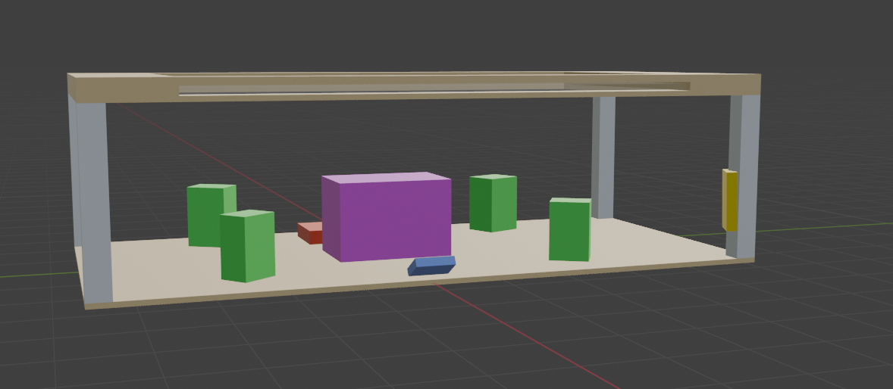
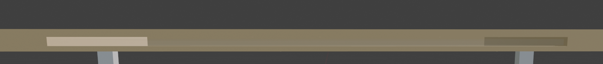
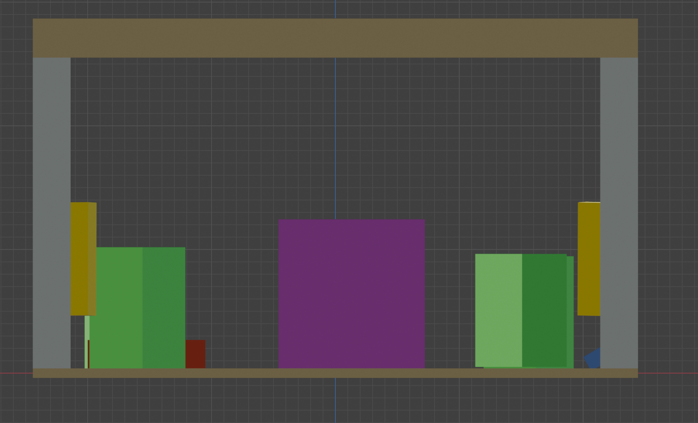
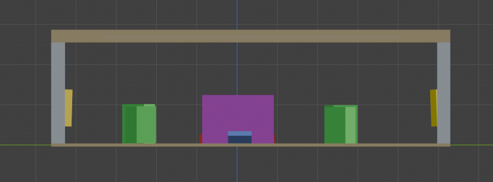

# Préproduction
> C'est ici qu'on dépose les éléments de la préproduction.

# Table des matières
1. [Intention ou concept](#Intention-ou-concept)
    - [Cartographie](#Cartographie)
    - [Intention de départ](#Intention-de-départ)
    - [Synopsis](#Synopsis)
    - [Tableau d'ambiance (*moodboard*)](#Tableau-d'ambiance-(*moodboard*))
    - [Scénario, scénarimage ou document audio/visuel](#Scénario,-scénarimage-ou-document-audio/visuel)
2. [Contenu multimédia à intégrer](#Contenu-multimédia-à-intégrer)
    - [Inventaire du contenu multimédia](#Inventaire-du-contenu-multimédia)
    - [Univers artistique des éléments](#Univers-artistique-des-éléments-centraux)
3. [Planification technique d'un prototype (devis technique)](#Planification-technique-(devis-technique))
    - [Schémas ou plans techniques](#Schémas-ou-plans-techniques)
    - [Matériaux requis](#Matériaux-de-scénographie-requis)
    - [Équipements requis](#Équipements-requis)
    - [Logiciels requis](#Logiciels-requis)
    - [Ressources humaines requises](#Ressources-humaines-requises)
    - [Ressources spatiales requises (rangement et locaux)](#Ressources-spatiales-requises-(rangement-et-locaux))
    - [Contraintes techniques et potentiels problèmes de production](#Contraintes-techniques-et-potentiels-problèmes-de-production)
4. [Planification de la production d'un prototype (budget et étapes de réalisation)](#Planification-de-la-production-(budget-et-étapes-de-réalisation))
    - [Budget prévisionnel](#Budget-prévisionnel)
    - [Échéancier global](#Échéancier-global)
    - [Liste des tâches à réaliser](#Liste-des-tâches-à-réaliser)
    - [Rôles et responsabilités des membres de l'équipe](#Rôles-et-responsabilités-des-membres-de-l'équipe))
    - [Moments des rencontres d'équipe](#Moments-des-rencontres-d'équipe)

# Intention ou concept
## Cartographie
> Exemples:

## Intention de départ
L'idée originale de ce projet est partie de l'idée de la table, on voulait créer quelque chose qui serait intéressant à intéragir avec, et qui pourrait intéresser n'importe-qui, notre projet donne beaucoup de pouvoir à l'intéracteur, et c'est ce qui d'après moi le rend différent, l'intéracteur peut créer des combinaisons que nous-mêmes n'avont pas fait.

## Synopsis
L'utilisateur intéragit avec en déplaçant une statuette avec un *fiducial* en bas pour faire apparaître et bouger des planètes et/ou d'autres objets astronomiques autour de l'orbite d'un soleil, représenté par la table elle même. Essentiellement, on construit notre propre système solaire! 

## Tableau d'ambiance (*moodboard*)
> Ajoutez ici une liste d'images, de vidéos, de documents audios ou multimédias qui vous inspirent. Une palette de couleur ainsi qu'un choix de typographie devraient également s'y trouver selon la nature du projet.

> Insérez directement des captures d'écran et liens vers des médias ici.

[Exemple de tableaux d'ambiance visuels (images, couleurs, typographie)](https://cmontmorency365.sharepoint.com/sites/TIM-58266B-Expriencemultimdiainteractive-Enseignants/Documents%20partages/Enseignants/hiv2021_expMulti_582-66BMO/4_Contenu/Modeles/tableau_ambiance/1_tableau_ambiance_exemple.pdf)

## Scénario, scénarimage ou document audio/visuel
[Exemple de scénarimage visuel pour vidéo d'animation](https://cmontmorency365.sharepoint.com/sites/TIM-58266B-Expriencemultimdiainteractive-Enseignants/Documents%20partages/Enseignants/hiv2021_expMulti_582-66BMO/4_Contenu/Modeles/scenarimage/storyboard_animation_exemple2.pdf)

# Contenu multimédia à intégrer
## Inventaire du contenu multimédia (jay - fini)

- ** statuettes (pour les utilisateur-trices)
- ** sons
- ** paysages sonores
- ** vfx d'animation 3D
- ** source lumineuse

Pour plus de détails: [Inventaire du contenu à intégrer](https://cmontmorency365.sharepoint.com/sites/TIM-58266B-Expriencemultimdiainteractive-Enseignants/_layouts/15/Doc.aspx?OR=teams&action=edit&sourcedoc={8D242B82-E599-49CF-BE4C-EA9539D2D1C3})

## Univers artistique des éléments
Voir colonne *Exemples de réalisation* dans l'[Inventaire du contenu à intégrer](https://cmontmorency365.sharepoint.com/sites/TIM-58266B-Expriencemultimdiainteractive-Enseignants/_layouts/15/Doc.aspx?OR=teams&action=edit&sourcedoc={8D242B82-E599-49CF-BE4C-EA9539D2D1C3}).

# Planification technique d'un prototype (devis technique)
## Schémas ou plans techniques

> Table modélisée dans Blender

> Angle différent de la table

> Fente pour glisser le panneau d'acrylique dans la table.

> table sur l'angle Y

> table sur l'angle X

### Plantation 

### Schéma de branchement 

## Matériel de scénographie requis ( jay/jacob - en cours )

> Liste des matériaux de scénographie (matériaux de décor) requis ou lien vers un tableur Excel ou document Markdown à part si nécessaire (quantité, spécifications techniques, lien vers fiche technique si applicable, commentaires...)

* Table
    * Matériaux: Bois, Métal, Acrylique, Spandex
    * dimensions de la table n'ont pas encore été déterminées
* grand studio avec les murs amovibles

## Équipements requis (jay/jacob - en cours)
> Liste des équipements requis par département ou lien vers un tableur Excel ou document Markdown à part si nécessaire (quantité, spécifications techniques, lien vers fiche technique si applicable, commentaires...)

* Audio
    * 4 haut-parleurs
    * 4 fils XLR 3 conducteurs de 15' (M->F)
    * 1 carte de son

* Vidéo
    * 4 projecteurs vidéo shortrow
    * 3 système d'acrochage
    * 1 caméra

* Lumière
    * 4 lumière LED RGBAW DMX
    * 4 fils XLR 3 conducteurs de 20'
    * Console DMX
    * Interface DMX USB

* Électricité
    * 4 cordon IEC (pour l'alimentation des haut-parleurs)
    * 5 multiprise

* Réseau
    * Switch poe 5 ports
    * 10 Cables Ethernet
    * 8 Cables HDMI
    * 3 Receivers HDMI
    * 3 Sender HDMI
    * 1 Capture card

* Ordinateur
    * 1 ordinateur

* micro ordinateur
    * 4 raspberry pi    
    

## Logiciels requis

* [Cycling 74' Max 8](https://cycling74.com/products/max)   
* [Unity 2019 lts](https://unity.com/)
* [Open stage control](https://openstagecontrol.ammd.net/)
* [Autodesk Maya](https://www.autodesk.com/ca-fr)
* [HyperHDR](https://github.com/awawa-dev/HyperHDR)
* [VCV Rack](https://vcvrack.com/)
* [Cardinal](https://cardinal.kx.studio/)
* [OBS](https://obsproject.com)
* [reacTIVision](https://reactivision.sourceforge.net)
* [sonobus](https://www.sonobus.net/)

## Ressources humaines requises

* Guillaume Arsenault.
* TTP
* Possiblement un soudeur

## Ressources spatiales requises (rangement et locaux)

* Grand studio
  * Espace avec faux murs pour projection autours de la table.
* Salle des matrices
  * Accès à plusieurs ports ethernet, possibilité de pouvoir avoir notre ordinateur dans cette salle. Possiblement également l'espace de rangement pour les statues de remplacement.

## Contraintes techniques et potentiels problèmes de production (Jacob - en cours)

| Contrainte ou problème potentiel                     | Solution envisagée                                    | Commentaires                                                                                 |
|------------------------------------------------------|-------------------------------------------------------|----------------------------------------------------------------------------------------------|
| Nous n'avons pas testé la caméra avec ReacTIVision    | Tester différentes caméras. | Dans le pire des Cas, c'est toujours possible d'utiliser une webcam, ou encore d'utiliser la librairie javascript que guillaume a trouvé|
| Notre ordinateur doit pouvoir communiquer avec trop de choses en HDMI ou DisplayPort | Expérimenter des façons d'éviter d'avoir trop de choses connectées à l'ordinateur à la fois.| Travailler avec Guillaume pour faire en sorte que NDI fonctionne sur PI, cela économiserait un port.|
|Nous ne pouvons pas faire la table nous-même. | Nous connaissons des soudeurs qui pourraient faire les parties métaliques pour nous.| Si ce n'est pas possible, on pourrait faire la table en bois complètement nous-même. |

# Planification de la production d'un prototype (budget et étapes de réalisation)
## Budget prévisionnel

[Lien vers document](https://cmontmorency365.sharepoint.com/:x:/s/TIM-58266B-Expriencemultimdiainteractive-Enseignants/ERS3zx4iKAlLn03N_0h3cyQBOV_nxNuKvrKnqmrXGcgDYg?e=Rjq9Uc)

## Échéancier global
Étapes importantes du projet visualisé dans GitHub (*milestones*):  
https://github.com/tim-montmorency/66B-modele_de_projet/milestones

*Dates importantes :*
- Première itération : lundi x novembre
- Prototype finale : lundi x décembre
- Présentation des projets devant public : jeudi 25 mars (soir)

## Liste des tâches à réaliser
Visualisation des tâches à réaliser dans GitHub selon la méthode Kanban:  
https://github.com/tim-montmorency/66B-modele_de_projet/projects/2?add_cards_query=is%3Aopen

Inventaire des tâches à réaliser dans GitHub selon le répertoire d'*issues*:  
https://github.com/tim-montmorency/66B-modele_de_projet/issues

## Rôles et responsabilités des membres de l'équipe ( etienne - finis )

**Mikaël Tourangeau**
- Modélisation et impression 3D des statuettes. 

**Étienne Charron**
- Comité Technique et coordination technique (suivi du devis technique);
- Programmation du module Max d'effet et de contrôle audio;
- Construction de la table

**Quoc huy Do**
- S'assure du bon fonctionnement de Unity;
- Coordination artistique;
- Installation et mise en place de la capture audiovidéo du projet en temps réel;
- Programmation du module Unity d'effets visuels et intégration dans Max.

**Jérémy Cholette**
- Création des paysages sonores
- Installation de l'équipement dans l'espace physique.

**Jacob Alarie-Brousseau**
- Coordination générale du projet (coordination de l'échéancier, du budget, suivi de la liste des tâches à réaliser, s'assurer de la répartition des rôles et des responsabilités des membres de l'équipe);
- Programmation du module Max en lien avec le fonctionnement de la détection des statuettes et de leur position;
- Construction de la table

## Moments des rencontres d'équipe ( etienne - finis )
Hebdomadaire
- **lundi "9:30"h (1h)** : Rencontre de suivi de projet.
- **lundi "17h" (1h)** : Rencontre du suivi de ce qu'on a réaliser pendant la semaine
